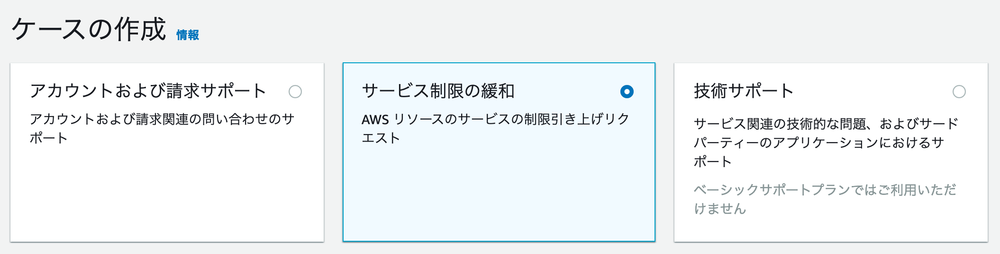

# Amazon SageMaker に関する上限緩和申請

ボケて電笑戦 (bokete DENSHOSEN) Workshop では、各ノートブックに記載されている Amazon SageMaker のリソースを利用します。利用状況によっては、AWS アカウントの Amazon SageMaker クォータが少なく、ハンズオンに必要なインスタンスが立ち上がらない場合があります (実行すると `ResourceLimitExceeded` エラーが表示されます)。そのままではハンズオンの一部をお試し頂けないため、事前の上限緩和申請が必要です。申請の承認には数日かかるため、ハンズオン参加の **1週間前** までには上限緩和申請をお願いします。

## 上限緩和の申請手順
以下では [AWS マネージメントコンソールの言語設定](https://console.aws.amazon.com/settings/home)が日本語になっている前提で手順を説明します。また、インスタンスタイプは [Keras のサンプルノートブック](notebook/keras_baseline/bokete_keras_on_sagemaker.ipynb) で利用予定の 
- SageMaker Studio (KernelGateway `ml.m5.large`) or SageMaker Notebook (`ml.m5.xlarge`)
- SageMaker Processing (`ml.g4dn.xlarge`)
- SageMaker Training (`ml.g4dn.2xlarge`)
- SageMaker Endpoints (`ml.g4dn.xlarge`) 

に関して上限緩和申請を行います。

1. はじめに使うリージョンを決めておく。
    1. 現在このハンズオンでサポートしているリージョンは以下の5つです: 
        1. US West (Oregon), `us-west-2`
        1. US East (Northern Virginia), `us-east-1`
        1. US East (Ohio), `us-east-2`
        1. Asia Pacific (Tokyo), `ap-northeast-1`
    1. ハンズオンでは、安いので US のリージョン「US West (Oregon)」or「US East (Northern Virginia)」or「US East (Ohio)」利用がオススメです。あるいは、SageMaker が利用な可能な他のリージョン、例えば日本の東京リージョン「Asia Pacific (Tokyo)」も利用可能です。
1. [AWS サポートセンター](https://console.aws.amazon.com/support/) にアクセス
1. 「ケースの作成」を選択。以下の手順に従って、制限タイプごとに4回繰り返します。 
1. 「サービス制限の緩和」を選択 
    1. 制限タイプ「SageMaker Studio」を選択 (テキスト入力 "studio" でフィルタリングできます)
        1. 手順 1. で決めたリージョンを選択
        1. 制限「KernelGateway-ml.m5.large」を選択
        1. 新しい制限値「1」を入力
        1. 申請理由の説明に「ハンズオンワークショップで利用。」などと記入
        1. 「送信」ボタンを押す
    1. 制限タイプ「SageMaker Processing Jobs」を選択 (テキスト入力 "processing" でフィルタリングできます)
        1. 手順 1. で決めたリージョンを選択
        1. 制限「ml.g4dn.xlarge」を選択したいが出てこないので、適当なインスタンス「ml.p3.2xlarge」などを選ぶ
        1. 新しい制限値「1」を入力
        1. 申請理由の説明に「ml.g4dn.xlarge の上限緩和 (制限値: 1) を希望。ハンズオンワークショップで利用。」などと記入
        1. 「送信」ボタンを押す
    1. 制限タイプ「SageMaker Training Jobs」を選択 (テキスト入力 "training" でフィルタリングできます)
        1. 手順 1. で決めたリージョンを選択
        1. リソースタイプ「SageMaker Training」を選択
        1. 制限「ml.g4dn.2xlarge」(`.xlarge` ではなく `.2xlarge` を利用) を選択
        1. 新しい制限値「1」を入力
        1. 申請理由の説明に「ハンズオンワークショップで利用。」などと記入
        1. 「送信」ボタンを押す
    1. 制限タイプ「SageMaker Endpoints」を選択 (テキスト入力 "endpoint" でフィルタリングできます)
        1. 手順 1. で決めたリージョンを選択
        1. リソースタイプ「SageMaker Hosting」を選択
        1. 制限「ml.g4dn.xlarge」を選択
        1. 新しい制限値「1」を入力
        1. 申請理由の説明に「ハンズオンワークショップで利用。」などと記入
        1. 「送信」ボタンを押す
1. これで申請は完了です。申請状況は [AWS サポートセンター](https://console.aws.amazon.com/support/)から確認できます。

## 参考
- [「Amazon SageMaker で ResourceLimitExceeded エラーを解決するにはどうすればよいですか?」](https://aws.amazon.com/jp/premiumsupport/knowledge-center/resourcelimitexceeded-sagemaker/?nc1=h_ls)
- [新規 AWS アカウントのデフォルト SageMaker クォータ](https://docs.aws.amazon.com/general/latest/gr/sagemaker.html#limits_sagemaker)
